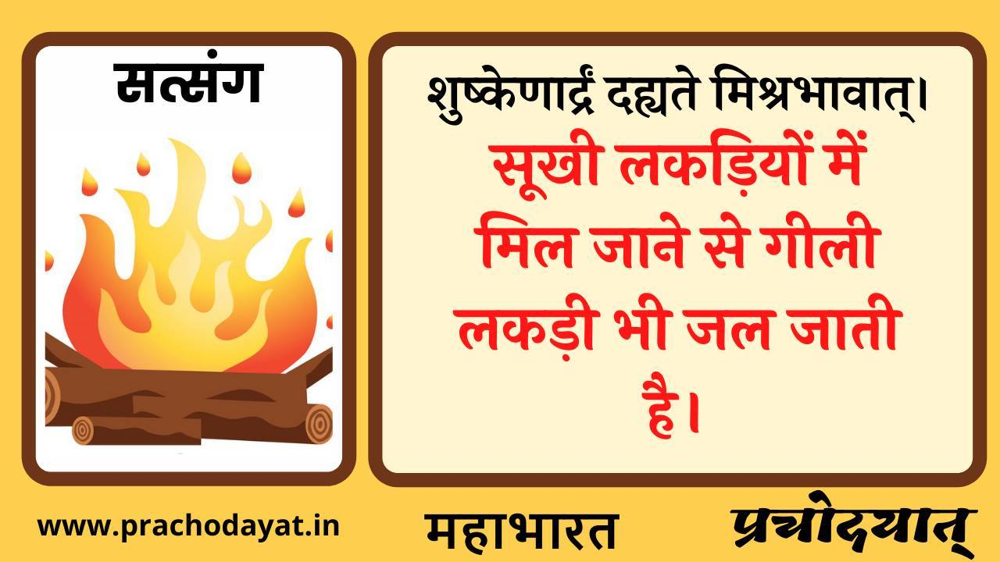

+++
title = "Choose right set of friends"
date = 2022-11-07
[taxonomies]
tags = [ "peers","satsang","gurukul"]
+++
+++
title = "Choose right set of friends"
date = 2022-11-07
[taxonomies]
tags = [ "peers","satsang","gurukul"]
+++
+++
title = "Choose right set of friends"
date = 2022-11-07
[taxonomies]
tags = [ "peers","satsang","gurukul"]
+++

आपके बालक के लिए एक अच्छा संग और संध ढूँढना पड़ेगा । आप स्वयं , संस्कार और आचारकी स्थिरता के लिए पर्याप्त नहीं हो। इसीलिए भारतीय शिक्षण व्यवस्थामें सहजीवन आधारित शिक्षण अत्यंत महत्वपूर्ण है। आजकी शालाकीय व्यवस्था से यह शक्य नहीं , पर्याप्त नहीं है| जो बोर्डिंग स्कुल है वहां भी , यह "सत्संग रूपी" भाव के अभाव के कारण पर्याप्त नहीं है। 

आयुर्वेदका सिद्धांत है ।  सामान्य-विशेष सिद्धांत । 

सर्वदा सर्वभावानाम सामान्यं वृद्धि कारणं, ह्रासहेतुर्विशेशाश्च प्रविर्त्ति रुभयस्य तू। 
सदा सब पदार्थों का द्रव्य,गुण और करम सामान्य (सामान होना) ही वृद्धि का कारण है, और विशेष अर्थात भिन्न या विपरीत होना ही ह्रास अर्थात कम हो जाने का कारण है । 

गीली लकड़ीका गीला होने का दोष अग्निके विशेष गुण से प्रभावित हो के टिकता नहीं!

सत्संगसे सामान्य (जो संघमें सामान्य रूपसे है) गुणकी वृद्धि होती है और विशेष विकारका ह्रास । 

गुरुकुल आदर्श है । यदि गुरुकुल संभव नहीं तो सहृदय परिवार के बच्चे शनि-रवि साथ में रहें । जब जब बड़ी बड़ी छुट्टियाँ हो तब साथ में भारत भ्रमण करें । हर एक प्रवास शैक्षणिक उद्देश्य से ही हो । दीपावली और गर्मी की छुट्टियों में केंप का आयोजन हो । बच्चों को एक दूसरे के घर (जहां घर का वातावरण आदर्श है) रहने भेजिए ।