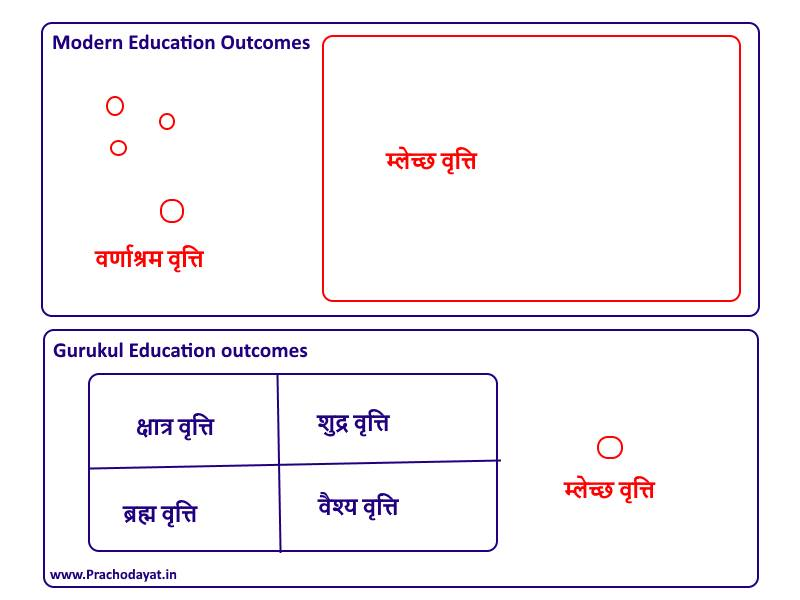

+++
title = "Education and वृत्ति निर्माण "
date = 2022-11-07
[taxonomies]
tags = [ "outcomes","mindset","virtues"]
+++

# Education and वृत्ति निर्माण

The important aspect of primary education is to develop वृत्ति . Moral and professional conduct in layman's English. It is one of those non-translatable word for me.

Besides bread-earning skills, education system's primary goal is to develop वृत्ति in students. System can develop on top of innate disposition (जन्मजात प्रकृति) and mold kids as better humans and citizens. If teacher is powerful, he or she can even alter जन्मजात प्रकृति to some extent.

If there are no conscious efforts in first 15 years of life, default configuration of mind will turn all as म्लेच्छ. म्लेच्छ वृत्ति is something that is undesirable for stability of the society.

त्यक्तस्वधर्माचरणा निर्घृणा: परपीडका: ।

चण्डाश्चहिंसका नित्यं म्लेच्छास्ते ह्यविवेकिन: ॥ ४४ ॥

(अर्थ :  अपने धर्म का आचरण करना छोड़ दिया हो, निर्घृण हैं, दूसरों को कष्ट  पहुँचाते हैं, क्रोध करते हैं, नित्य हिंसा करते हैं, अविवेकी हैं - वे म्लेच्छ हैं।)

Modern education not only develop म्लेच्छ , it also turn kids born with good-sanskar into म्लेच्छ !

Urgent need to get rid of slave producing education.

And it begins with proper conscious child planning. Most of the kids right now are born accidentally, as 1 night mistake. Such raw material can't emerge as great citizens.

The diagram explains present education vs ideal education and their role in वृत्ति निर्माण . It is self-explanatory.