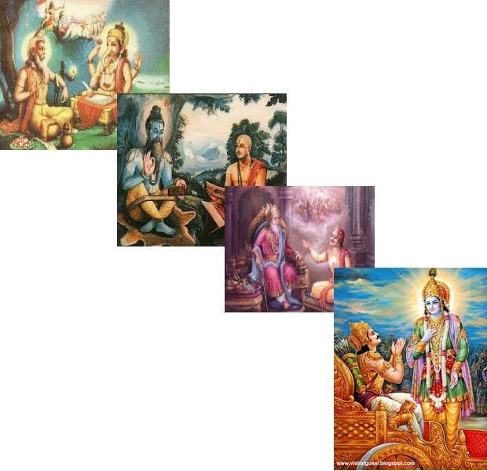

+++
title = "Story telling for all subjects"
date = 2022-11-08
[taxonomies]
tags = [ "pedagogy","storytelling"]
+++

If you are teacher, no matter which subject you teach, you should develop a habit of integrating your content in story.

I liked movie 'Inception' very much for its recursive multi layered story telling. With each layer within layer, mind opens up new avenues. It is endurance exercise for the mind like how  you swim or run marathon for physical body.

We have rich history of such recursive events in Maha kavya(s).

For Example Bhagwad Gita - In the periphery, it is Ved Vyasa narrating Mahabharata to Ganesh ji. The outer layer is conversation between Bhagwan Ved Vyas and Janmejaya. The inner conversation is between Dhritrashtra and Sanjaya. And the core is between Krishna and Arjun. Within each layer, time slows down. Within each word, there is depth of infinity!

we were the first to invent recursive stories, powerful enough to alter brain circuits, helping curing mental diseases and keeping humans on the path of dharma!

Dharma upadesa  in plain dry dull sermons and vs Dharma upadesa by recursive Maha kavya(s) and Purana(s). Makes a lot of difference in activating brain circuits and preparing it for the actions as per dharma narrated.

I suggest, Ramayana and Mahabharata recitation should be part of daily chores. It is potent therapeutic help for growing minds at home i.e. Children.

Even reading silently is not worth. Speak up! Recite! Let there be संवाद!! Let your brains connect with each other and activate dharma circuits in brain so that mind can drive it for dharmic actions!! 🙂
--------------------------
Guber argues that humans simply aren’t moved to action by "data dumps," dense PowerPoint slides, or spreadsheets packed with figures. People are moved by emotion. The best way to emotionally connect other people to our agenda begins with "Once upon a time…"

**Reference**
https://www.fastcompany.com/1680581/why-storytelling-is-the-ultimate-weapon
