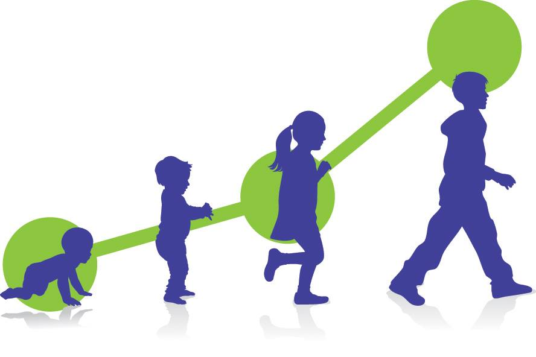

+++
title = "Child Development Quantum leap"
date = 2022-11-08
[taxonomies]
tags = ["parenting","development"]
+++

Quantum leap = a sudden large increase or advance in the physiological state of the universe.
Our body is a reflection of the Universe. Macrocosm is reflected in microcosm. 

During childhood, many such Quantum leap events happen in physical body. It is part of development of Annamay Kosh. Result ? Seasonal sickness. Viral infection. 

If you are relatively serving healthy mental environment to kids (no stress, no conflict, no loud noise, sound night sleep, fresh air), you should not worry much about Quantum leap events. They are good for them. They purge toxic outcomes of sudden growth triggering events. 

Only events to worry about are events with stressful past. For example, kid could not sleep well for continuous three nights. Kid consumed toxic food (pale cooked long time back or chocolate or biscuits). Rest of the minor hiccups are needed for their growth.

"Diseases are crises of purification, of toxic elimination. Symptoms are the natural defences of the body. We call them diseases, but in fact they are the cure of diseases." - Hippocrates.
Above is not completely true for adults in aging phase i.e 21+. We adults generally experience Quantum leap events of decaying.   🙂

PS: I am not medico professional. These are my observations.