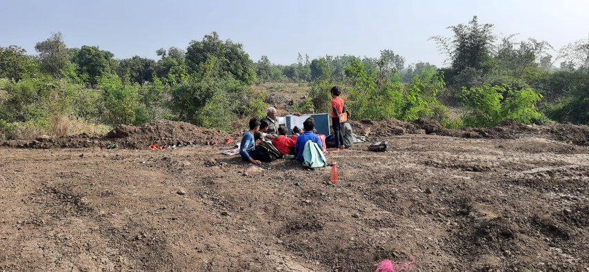

+++
title = "Open Air Classroom"
date = 2022-11-07
[taxonomies]
tags = [ "setup","school-infra" ]
+++

.

Open air Sanskrit Session during winter 🙂 
This group completed 18 months of Sanskrit  learning.

* मूल अष्टाध्यायी आधारित संस्कृत शिक्षण
* पुष्पा दीक्षित जी की गुरु शिष्य परंपरा 
* सुभाषित से सुगंधित परंपरा
* संभाषण से सज्जित परंपरा
* प्रकृति प्रेरित परंपरा
* सिलेबस नही साधना प्रेरित परंपरा
* फीस और सैलरी से पर, गुरु दक्षिणा पोषित परंपरा
* रामायण और महाभारत अभ्यास की परंपरा
* योग सूत्र अभ्यास के ध्येय से प्रेरित परंपरा