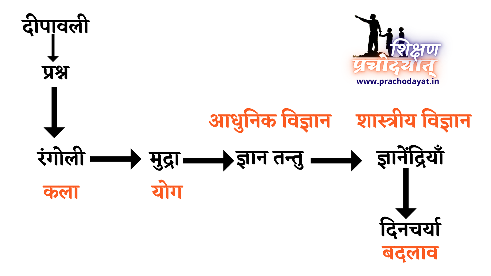

+++
title = "Can art and science go together?"
date = 2022-11-07
[taxonomies]
tags = [ "pedagogy","framework" ]
+++

.

**Can art and science go together in same session?**

All my science sessions have reference to art, culture, self. To me, it is best way to make fundamentals of science permenant on growing mind. It is the potent way to create long lasting life-science impressions.

दीपावली की छुट्टियों के बाद प्रथम दिन था और विज्ञान का वर्ग था। मेरा उद्देश्य ज्ञान तंतुओ के शरीर में फैले जाल का अनुभव करवाना था ।

बात प्रारंभ हुई दीपावली के अनुभवों से । प्रश्न आया रंगोली का । क्यूँ रंगोली करनी चाहिए?
बात को में खींच के ले गया रंगोली में लगने वाली ज्ञान मुद्रा पर । ज्ञान मुद्रा से गए ज्ञान तन्तुओ के तंत्र पर । ज्ञान तन्तु के तंत्र में बात की पड़ोसी ज्ञानतन्तु जालों की गतिविधि पर। फिर आए दांत और हृदय के ज्ञानतन्तुमय संपर्क पर और एक बात दृढ़ की के अच्छे आचार विचार के लिए भी दांत की अच्छी संभाल रखनी पड़ेगी।
विज्ञान के मार्ग पर दिनचर्या समझने पर कौन बालक दिनचर्या को जीवन में स्थिर करने में आलस करेगा? शिष्टाचार और शिस्त स्थिर करने हेतु योग्य मार्ग है विज्ञान का मार्ग।